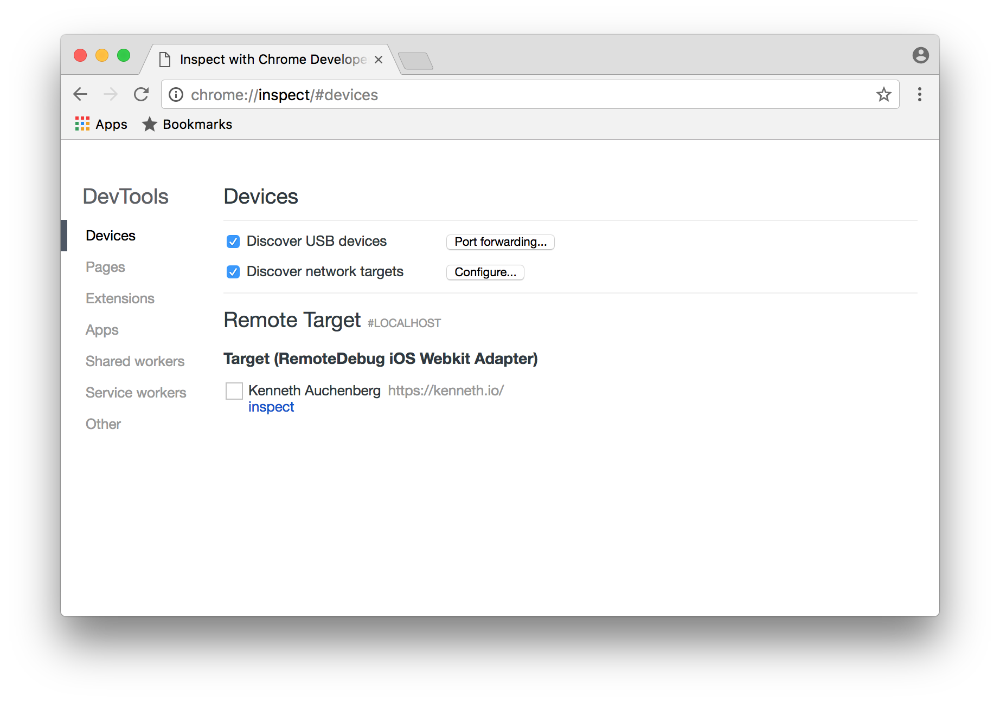
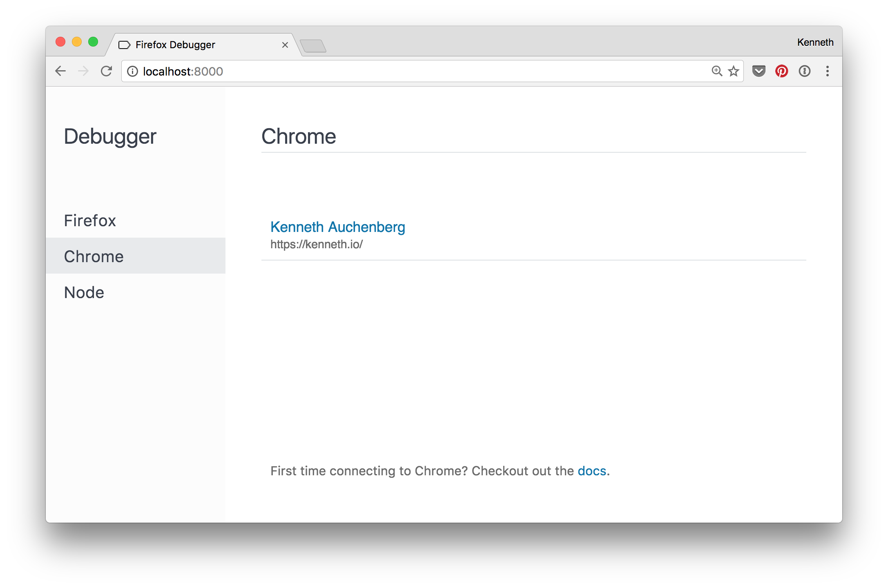
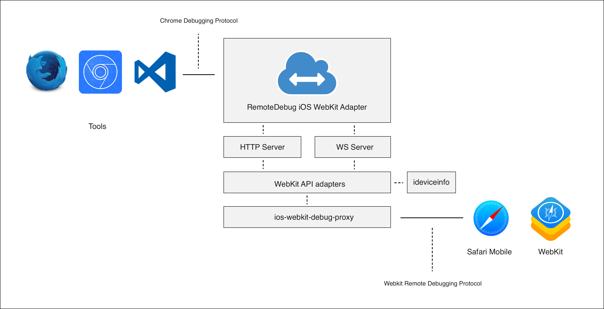

# RemoteDebug iOS WebKit Adapter


<a href="https://github.com/RemoteDebug/remotedebug-ios-webkit-adapter/releases"></a>

RemoteDebug iOS WebKit Adapter is an protocol adapter that Safari and WebViews on iOS to be debugged from tools like VS Code, Chrome DevTools, Mozilla Debugger.html and other tools compatible with the Chrome Debugging Protocol.


Read more in the introduction blog post on Medium: [Hello RemoteDebug iOS WebKit Adapter: iOS web debugging with Chrome DevTools, VS Code & Mozilla Debugger.html 📡📱](https://medium.com/@auchenberg/hello-remotedebug-ios-webkit-adapter-ios-web-debugging-with-chrome-devtools-vs-code-mozilla-2a8553df7465)

## Getting Started

### 1) Install dependencies

Before you use this adapter you need to make sure you have the [latest version of iTunes](http://www.apple.com/itunes/download/) installed, as we need a few libraries provided by iTunes to talk to the iOS devices.

#### Linux

Follow the instructions to install [ios-webkit-debug-proxy](https://github.com/google/ios-webkit-debug-proxy#installation)  and [libimobiledevice](https://github.com/libimobiledevice/libimobiledevice)

#### Windows

Install [ios-webkit-debug-proxy](https://github.com/google/ios-webkit-debug-proxy#installation)  and [libimobiledevice](https://github.com/libimobiledevice/libimobiledevice). On Windows you can use [scoop](http://scoop.sh/):

```
scoop bucket add extras
scoop install ios-webkit-debug-proxy
```


#### OSX/Mac
Make sure you have Homebrew installed, and run the following command to install [ios-webkit-debug-proxy](https://github.com/google/ios-webkit-debug-proxy) and [libimobiledevice](https://github.com/libimobiledevice/libimobiledevice)

```
brew update
brew unlink libimobiledevice ios-webkit-debug-proxy usbmuxd
brew uninstall --force libimobiledevice ios-webkit-debug-proxy usbmuxd
brew install --HEAD usbmuxd
brew install --HEAD libimobiledevice
brew install --HEAD ios-webkit-debug-proxy
```

### 2) Install latest version of the adapter

```
npm install remotedebug-ios-webkit-adapter -g
```

### 3) Enable remote debugging in Safari
In order for your iOS targets to show up, you need to enable remote debugging.

Open iOS Settings => Safari preferences => enable "Web Inspector"

### 4) Make your computer trust your iOS device.

On MacOS you can use Safari to inspect an iOS Safari tab. This will ensure the device is trusted.

On Windows starting iTunes could prompt the "Trust this computer" dialog.

### 5) Run the adapter from your favorite command line

```
remotedebug_ios_webkit_adapter --port=9000
```

BTW: `ios-webkit-debug-proxy` will be run automatically for you, no need to start it separately.


### 6) Open your favorite tool

Open your favorite tool such as Chrome DevTools or Visual Studio Code and configure the tool to connect to the protocol adapter.

## Configuration

```
Usage: remotedebug_ios_webkit_adapter --port [num]

Options:
  -p, --port  the adapter listerning post  [default: 9000]
  --version   prints current version

```

## Usage
### Usage with Chrome (Canary) and Chrome DevTools

You can have your iOS targets show up in Chrome's `chrome://inspect` page by leveraging the new network discoverbility feature where you simple add the IP of computer running the adapter ala `localhost:9000`.



### Using with Mozilla debugger.html

You can have your iOS targets show up in [Mozila debugger.html](https://github.com/devtools-html/debugger.html), by starting `remotedebug_ios_webkit_adapter --port=9222` and selecting the Chrome tab.



### Using with Microsoft VS Code

Install [VS Code](https:/code.visualstudio.com), and the [VS Code Chrome Debugger](https://marketplace.visualstudio.com/items?itemName=msjsdiag.debugger-for-chrome), then create a `launch.json` configuration where `port` is set to 9000, like below:

```json
{
    "version": "0.2.0",
    "configurations": [
        {
            "name": "iOS Web",
            "type": "chrome",
            "request": "attach",
            "port": 9000,
            "url": "http://localhost:8080/*",
            "webRoot": "${workspaceRoot}/src"
        }
    ]
}
```

## Architecture
The protocol adapter is implemented in TypeScript as Node-based CLI tool which starts an instance of [ios-webkit-debug-proxy](https://github.com/google/ios-webkit-debug-proxy), detects the connected iOS devices, and then starts up an instance of the correct protocol adapter depending on the iOS version.



## How to contribute

```
npm install
npm start
```

## Diagnostics logging

```
DEBUG=remotedebug npm start
```

### License
MIT
